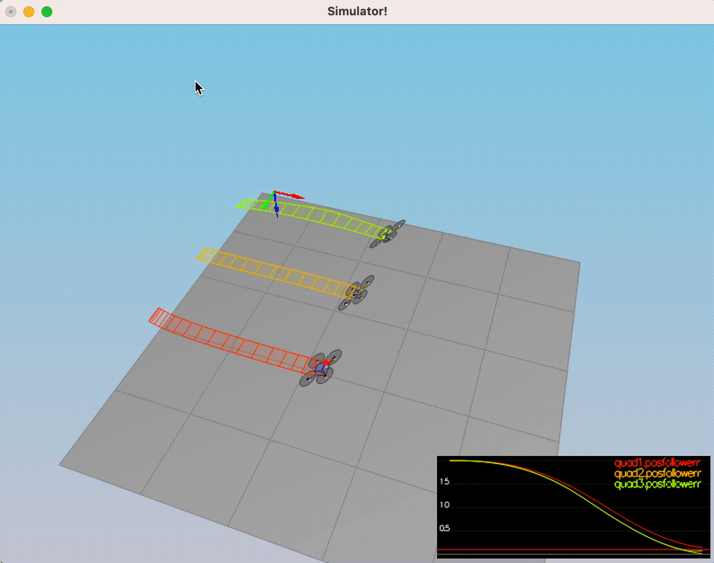

# Project Write Up #

In this project our objective is to implement components of a Drone Controller, by going through the recommended steps in the course:

- Body-rate controller
- Roll-pitch controller
- Altitude controller
- Lateral controller
- Yaw controller

In this write up we will go step by step for the design decisions, based from first principles till we build up the controller.

The architecture of the controller was derived from Professor Angela P. Schoellig work, from the Udacity course, and from her publications. The controller design is based on the _continuous-time_ system dynamics representation, for a trajectory following application.


More on A. P. Schoellig, C. Wiltsche and R. D'Andrea,  2012 American Control Conference (ACC),

## Deriving Motor Forces and Body Rate - Scenario 2 ##

In order to go explain how we did derive the Motor forces and Body Rates, we would have to go to explain first principles.


### Physical Configuration Layout and Principles

A quadcopter in an "X" configuration has four motors arranged symmetrically around its center of mass but oriented diagonally relative to the body's forward direction. This layout facilitates nuanced control over flight dynamics, including lift (thrust), roll ( $\phi$ ), pitch ( $\theta$ ), and yaw ( $\psi$ ), through differential thrust among the four motors.

* $F_1$ Motor 1 (Front Left)
* $F_2$ Motor 2 (Front Right)
* $F_3$ Motor 3 (Rear Right)
* $F_4$ Motor 4 (Rear Left)


### Equations for Dynamics


1. **Total Thrust $T$**: The collective lift or vertical thrust exerted by the quadcopter against gravity. It's the sum of the thrusts from all four motors:
 $T = F_1 + F_2 + F_3 + F_4 $ 

2. **Roll Moment $\tau_{\phi}$**: Generated by creating a differential in thrust between the left and right sets of motors. In an "X" configuration, this involves all four motors due to their diagonal arrangement:
 $\tau_{\phi} = (F_1 + F_3) - (F_2 + F_4) \times d $ 

3. **Pitch Moment $\tau_{\theta}$**: Similar to roll but involves creating a differential in thrust between the front and back motors:
 $\tau_{\theta} = (F_1 + F_2) - (F_3 + F_4) \times d $ 

4. **Yaw Moment $\tau_{\psi}$**: Arises from the torque difference due to counter-rotating pairs of motors. This differential torque induces rotation about the quadcopter's vertical axis:
 $\tau_{\psi} = (F_1 - F_2 + F_3 - F_4) \times \kappa $ 

Here,  $d$  is the distance from each motor to the center of mass, and  $\kappa$  represents the conversion factor from motor speed to generated torque, taking into account the aerodynamic drag of the propellers.

### Derivation of Control Matrix from Motor Ratios and Physical Parameters

The following matrix directly maps the desired flight dynamics ( $T, \tau_{\phi}, \tau_{\theta}, \tau_{\psi}$ ) to the individual motor thrust commands ( $F_1, F_2, F_3, F_4$ ). For an "X" configuration quadcopter, considering the above equations and simplifying based on symmetric design and equal arm lengths, we can express as:

```math
\begin{bmatrix}
T \\
\tau_{\phi} \cdot d^{-1} \\
\tau_{\theta} \cdot d^{-1} \\
\tau_{\psi} \cdot \kappa^{-1}
\end{bmatrix}
=
\begin{bmatrix}
1 & 1 & 1 & 1 \\
1 & -1 & 1 & -1 \\
1 & 1 & -1 & -1 \\
1 & -1 & -1 & 1
\end{bmatrix}
\begin{bmatrix}
F_1 \\
F_2 \\
F_3 \\
F_4
\end{bmatrix}
```

from which we can derive the forces system

```math
\begin{bmatrix}
F_1 \\
F_2 \\
F_3 \\
F_4
\end{bmatrix}
= \frac{1}{4}
\begin{bmatrix}
1 & \frac{1}{d} & \frac{1}{d} & \frac{1}{\kappa} \\
1 & -\frac{1}{d} & \frac{1}{d} & -\frac{1}{\kappa} \\
1 & \frac{1}{d} & -\frac{1}{d} & -\frac{1}{\kappa} \\
1 & -\frac{1}{d} & -\frac{1}{d} & \frac{1}{\kappa}
\end{bmatrix}
\begin{bmatrix}
T \\
\tau_{\phi} \\
\tau_{\theta} \\
\tau_{\psi}
\end{bmatrix}
```

By solving the system we do optain individual Motor forces:

1. **Front-left Motor $F_1$**:
```math
F_1 = \frac{1}{4} \left( T + \frac{\tau_{\phi}}{d} + \frac{\tau_{\theta}}{d} + \frac{\tau_{\psi}}{\kappa} \right)
```

2. **Front-right Motor $F_2$**:

```math
F_2 = \frac{1}{4} \left( T - \frac{\tau_{\phi}}{d} + \frac{\tau_{\theta}}{d} - \frac{\tau_{\psi}}{\kappa} \right)
```

3. **Rear-left Motor $F_3$**:

```math
F_3 = \frac{1}{4} \left( T + \frac{\tau_{\phi}}{d} - \frac{\tau_{\theta}}{d} - \frac{\tau_{\psi}}{\kappa} \right)
```

4. **Rear-right Motor $F_4$**:
```math
F_4 = \frac{1}{4} \left( T - \frac{\tau_{\phi}}{d} - \frac{\tau_{\theta}}{d} + \frac{\tau_{\psi}}{\kappa} \right)
```

Applying $d = L / \sqrt{2}$ and deriving the ratios to simplify the code we get following command adjustments for each motor.

```cpp
VehicleCommand QuadControl::GenerateMotorCommands(float collThrustCmd, V3F momentCmd)
{   
    float tau_psi_z = momentCmd.z / kappa; // Yaw moment / kappa
    float d = L/sqrtf(2.f);
    float tau_phi_x = momentCmd.x / d; // Roll Moment / d
    float tau_teta_y = momentCmd.y / d; // Pitch Moment /d
    
    float cmd_front_left = (collThrustCmd + tau_phi_x + tau_teta_y - tau_psi_z) / 4.f;
    float cmd_front_right = (collThrustCmd - tau_phi_x + tau_teta_y + tau_psi_z) / 4.f;
    float cmd_rear_left = (collThrustCmd + tau_phi_x - tau_teta_y + tau_psi_z) / 4.f;
    float cmd_rear_right = (collThrustCmd - tau_phi_x - tau_teta_y - tau_psi_z) / 4.f;
    
    // Set motor commands in the class variable
    cmd.desiredThrustsN[0] = cmd_front_left;
    cmd.desiredThrustsN[1] = cmd_front_right;
    cmd.desiredThrustsN[2] = cmd_rear_left;
    cmd.desiredThrustsN[3] = cmd_rear_right;
    return cmd;

}
```

### Matrix Representation and Proportional Control for Body Rates

The proportional controller for body rates translates desired angular velocities into moments ( $\tau$ ) by applying proportional gains ( $k_{PQR}$ ) to the rate errors in roll, pitch, and yaw. This can be represented as:
```math
\tau = \mathbf{I} \cdot \mathbf{k}_{PQR} \cdot (\omega_{cmd} - \omega) 
```
where:
-  $\tau$  are the moments needed for correcting angular velocities to their desired values.
-  $\mathbf{I}$  is the inertia matrix, encapsulating the quadcopter's moments of inertia.
-  $\mathbf{k}_{PQR}$  is a diagonal matrix containing the proportional gains for roll, pitch, and yaw controls.
-  $\omega_{cmd}$  and  $\omega$  represent the desired and current angular velocities, respectively.

This formulation ensures that the controller accounts for the drone's physical characteristics, including its moments of inertia, when calculating the commanded moments to achieve desired body rates, thereby stabilizing the quadcopter's orientation and trajectory effectively.

```cpp
V3F QuadControl::BodyRateControl(V3F pqrCmd, V3F pqr)
{

  V3F momentCmd;

  V3F Insta;
  Insta.x = Ixx;
  Insta.y = Iyy;
  Insta.z = Izz;
    
  V3F rateError = pqrCmd - pqr;
    
  momentCmd = Insta* kpPQR * rateError;
  return momentCmd;
}
```

## Deriving Roll and Pitch Control rates - Scenario 2 (continued)

First, we need to understand the desired acceleration in the body frame. The accelerations $\ddot{x}$ and $\ddot{y}$ in the body frame are proportional to the tilt angles $b^x$ and $b^y$ because tilting the drone creates a component of thrust in the respective body frame direction.

The proportional relationship is given by:

```math
\begin{align*}
\ddot{x} = c \cdot b^x \\
\ddot{y} = c \cdot b^y
\end{align*}
```

where:
- $c$ is the total upward thrust generated by the drone's motors divided by the mass of the drone.
- $b^x$ and $b^y$ are the tilt angles in the body frame about the x and y axes, respectively.

Given the desired accelerations $\ddot{x}_c$ and $\ddot{y}_c$ in the body frame, we can solve for the desired tilt angles $b^x_c$ and $b^y_c$:

```math
\begin{align*}
b^x_c = \frac{\ddot{x}_c}{c} \\
b^y_c = \frac{\ddot{y}_c}{c}
\end{align*}
```

The total collective thrust command ($u_1 $) is converted into acceleration by dividing by the mass of the drone:

```math
c = \frac{u_1}{m}
```

The desired tilt angles need to be constrained to ensure they are within the physical limits of the drone's ability to tilt without losing control or altitude. This is done using a constraint function that limits the angles to a maximum tilt angle $( \text{maxTiltAngle} )$:

```math
\begin{align*}
b^x_c = \text{CONSTRAIN}\left(\frac{\ddot{x}_c}{c}, -\text{maxTiltAngle}, \text{maxTiltAngle}\right) \\
b^y_c = \text{CONSTRAIN}\left(\frac{\ddot{y}_c}{c}, -\text{maxTiltAngle}, \text{maxTiltAngle}\right)
\end{align*}
```

In the code, the collective thrust command is negative due to the NED (North, East, Down) coordinate system used:

```cpp
float c = -collThrustCmd / mass;
float b_x_cmd = CONSTRAIN(accelCmd.x / c, -maxTiltAngle, maxTiltAngle);
float b_y_cmd = CONSTRAIN(accelCmd.y / c, -maxTiltAngle, maxTiltAngle);
```

### Proportional Control

A proportional controller adjusts the roll and pitch rates based on the error between the desired and actual tilt angles.

```math
\begin{align*}
\dot{b}^x_c &= k_p \cdot (b^x_c - b^x_a) \\
\dot{b}^y_c &= k_p \cdot (b^y_c - b^y_a)
\end{align*}
```

### Error Calculation

The error for the roll and pitch angles is calculated by subtracting the actual angle obtained from the rotation matrix  $R$ from the desired angle.

```math
\begin{align*}
b_{x_{\text{error}}} &= b^x_c - R_{13} \\
b_{y_{\text{error}}} &= b^y_c - R_{23}
\end{align*}
```

### Signal Generation

The error is then used to generate the control signals, which are the desired body rates for roll $p_c$ and pitch $q_c$

```math
\begin{pmatrix} p_c \\ q_c \end{pmatrix} = \frac{1}{R_{33}} \begin{pmatrix} R_{21} & -R_{11} \\ R_{22} & -R_{12} \end{pmatrix} \times \begin{pmatrix} \dot{b}^x_c \\ \dot{b}^y_c \end{pmatrix}
```

which completes our calculations that that take place in the ```QuadControl::RollPitchControl``` function.

```cpp
V3F QuadControl::RollPitchControl(V3F accelCmd, Quaternion<float> attitude, float collThrustCmd)
{
 V3F pqrCmd;
 Mat3x3F R = attitude.RotationMatrix_IwrtB();
  if (collThrustCmd > 0) {
      float c = -collThrustCmd / mass;
      float b_x_c_target = CONSTRAIN(accelCmd.x / c, -maxTiltAngle, maxTiltAngle);
      float b_y_c_target = CONSTRAIN(accelCmd.y / c, -maxTiltAngle, maxTiltAngle);
      float b_x_error = b_x_c_target - R(0, 2);
      float b_y_error = b_y_c_target - R(1, 2);
      p_cmd = (R(1, 0) * kpBank * b_x_error - R(0, 0) * kpBank * b_y_error) / R(2, 2);
      q_cmd = (R(1, 1) * kpBank * b_x_error - R(0, 1) * kpBank * b_y_error) / R(2, 2);
      pqrCmd.x = p_cmd;
      pqrCmd.y = q_cmd;
  } else {
      pqrCmd.x = 0.0;
      pqrCmd.y = 0.0;
  }
  return pqrCmd;
}
```

The results gives us the following simulation


Let's delve into the implementation details for the altitude, yaw, and lateral position control for a drone, integrating the provided PID control equations, non-linear control equations, and code snippets from C++.

## Altitude, Lateral Position, and Yaw - Scenario 3 and 4
### Altitude Controller Implementation

The altitude controller's goal is to maintain a set altitude by controlling vertical acceleration and thus vertical thrust.

**Error Calculation**:

The difference between the target altitude $z_{\text{target}}$ and the actual altitude $z_{\text{actual}}$ is calculated to find the altitude error $e$. 
While The rate of altitude change is also considered $\dot{e}$.

```math
e = z_{\text{target}} - z_{\text{actual}}
```
```math
\dot{e} = \dot{z}_{\text{target}} - \dot{z}_{\text{actual}}
```

```cpp
    float posZErr = posZCmd - posZ;
    float velZErr = velZCmd - velZ;
```

**PID Control**:
A PID controller computes a control signal based on the altitude error and its derivatives. $\bar{u_z}$ , incorporating proportional $k_p$ , derivative $k_d$ , and integral $k_i$ components, as well as a feed-forward term $\ddot{z}_{\text{ff}}$ .

The integral term is often implemented discretely by summing the error over time, multiplied by the time step $dt$.
 
```math  
 \bar{u}_1 = k_p e + k_d \dot{e} + k_i \int_0^t e(t')dt' + \ddot{z}_{\text{ff}}
```

```cpp
  integratedAltitudeError += posZErr * dt;
  float u1_bar = kpPosZ * posZErr + kpVelZ * velZErr + KiPosZ * integratedAltitudeError + accelZCmd ;
```

**Thrust Adjustment**:

In the course we learend that linear acceleration can be expressed by the next linear equation

```math
\begin{pmatrix} \ddot{x} \\ \ddot{y} \\ \ddot{z}\end{pmatrix}  = \begin{pmatrix} 0 \\ 0 \\ g\end{pmatrix} + R \begin{pmatrix} 0 \\ 0 \\ c \end{pmatrix} 
```

where $R = R(\psi) \times R(\theta) \times R(\phi)$. The individual linear acceleration has the form of 

```math
\begin{align}
\ddot{x} &= c b^x \\ 
\ddot{y} &= c b^y \\ 
\ddot{z} &= c b^z +g
\end{align}
```

where $b^x = R_{13}$, $b^y= R_{23}$ and $b^z = R_{33}$ are the elements of the last column of the rotation matrix. 

We are controlling the vertical acceleration: 

```math
\bar{u}_1 = \ddot{z} = c b^z +g
```

Therefore 

$$c = (\bar{u}_1-g)/b^z$$  

which lead us to the following transformation of thrust

```cpp
    float acc = (u1_bar - CONST_GRAVITY) / R(2,2);
    thrust = -mass * acc;
    thrust = CONSTRAIN(thrust, 4 * minMotorThrust, 4 * maxMotorThrust);
```

Putting it all together we obtain the ```QuadControl::AltitudeControl()``` implementation

```cpp

float QuadControl::AltitudeControl(float posZCmd, float velZCmd, float posZ, float velZ, Quaternion<float> attitude, float accelZCmd, float dt)
{

  Mat3x3F R = attitude.RotationMatrix_IwrtB();
  float thrust = 0;

  float posZErr = posZCmd - posZ;
  float velZErr = velZCmd - velZ;
  // Calculate the PID output for altitude control
  integratedAltitudeError += posZErr * dt;

  float u1_bar = kpPosZ * posZErr + kpVelZ * velZErr + KiPosZ * integratedAltitudeError + accelZCmd ;

  // Convert acceleration to thrust and adjust for the drone's orientation
  float acc = (u1_bar - CONST_GRAVITY) / R(2,2);
  thrust = -mass * acc;
  thrust = CONSTRAIN(thrust, 4 * minMotorThrust, 4 * maxMotorThrust);

  return thrust;
}

```
 
### Lateral Position Controller

The lateral position controller aims to maintain or change the drone's position in the North-East (NE) plane.

**PD Control for Acceleration Command**:

The controller first computes the desired lateral accelerations using a PD controller, in the NE plane based on position and velocity errors, applying proportional $k_p$ and derivative $k_d$ gains.

```math
\begin{align}
x_{\text{error}} = x_{\text{target}} - x_{\text{actual}} \\
\dot{x}_{\text{error}} = \dot{x}_{\text{target}} - \dot{x}_{\text{actual}} \\
\ddot{x}_{\text{command}} = k_p^x * x_{\text{error}}  + k_d^x *\dot{x}_{\text{error}} + \ddot{x}_{\text{target}}
\end{align}
```

Putting it together we get the following implementation of ```QuadControl::LateralPositionControl()``` , with constraints in consideration

```cpp
V3F QuadControl::LateralPositionControl(V3F posCmd, V3F velCmd, V3F pos, V3F vel, V3F accelCmdFF)
{
   // .....

  // Compute position and velocity errors
  V3F posError = posCmd - pos;
  V3F velError = velCmd - vel;

  // Apply PD controller to compute desired acceleration
  accelCmd += kpPosXY * posError + kpVelXY * velError;

  // Limit the acceleration to maxAccelXY
  if (accelCmd.magXY() > maxAccelXY) {
      accelCmd = accelCmd.norm() * maxAccelXY;
  }

  accelCmd.z = 0; // Ensure no vertical component in the lateral control output

  return accelCmd;
}
```

### Yaw Controller

The yaw controller maintains a set heading using a simple proportional controller.

**Proportional Control**:

A simple P controller adjusts the yaw rate based on the heading error. The yaw rate command $r_c$ is calculated by multiplying the difference between the target and actual yaw angles by a proportional gain $k_p$. Where The control signal $r_c$ is the commanded yaw rate

```math
r_c = k_p (\psi_{\text{target}} - \psi_{\text{actual}})
```

This is a standard proportional control where $r_c$ is the commanded yaw rate, $k_p$ is the proportional gain, $\psi_{\text{target}}$ is the desired yaw, and $\psi_{\text{actual}}$ is the current yaw.

We use the `fmodf` function is used to ensure that the yaw error is within the range $[-2\pi, 2\pi]$. This is necessary because yaw angles can wrap around beyond $2\pi$ radians (360 degrees), and we want to ensure we take the shortest path to the target yaw.

Then the `if` conditions then adjust the yaw error to be within $[-pi, pi]$ so that the drone rotates the shortest distance to the desired yaw, whether that means rotating clockwise or counterclockwise.

The proportional gain $k_p$ is then applied to the yaw error to calculate the yaw rate command $r_c$ , which is the rate at which the drone should change its yaw to reduce the error.

This implementation of ```QuadControl::YawControl()``` ensures that the drone yaws towards the commanded heading as efficiently as possible, by always taking the shortest rotational path.

```cpp
float QuadControl::YawControl(float yawCmd, float yaw)
{
  
  float yawRateCmd=0;

  float yawError = fmodf(yawCmd - yaw, 2 * F_PI);
  if (yawError > F_PI) {
      yawError -= 2 * F_PI;
  } else if (yawError < -F_PI) {
      yawError += 2 * F_PI;
  }

  yawRateCmd = kpYaw * yawError;
  
  return yawRateCmd;

}
```

### Results

I am out of words from this write up to describe the results, am just glad :D !


